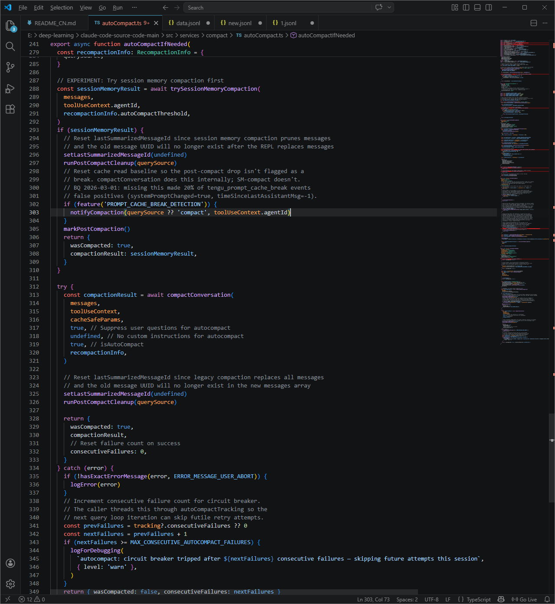
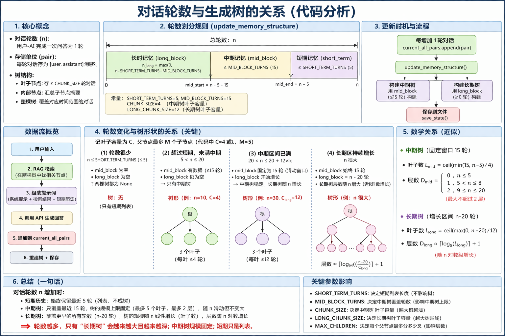

---

# Claude Code 记忆管理优化方案说明

阅读 Claude Code 泄露源码记忆管理部分后个人优化版本
本项目作为一个说明书防止遗忘的
"你说的对，我不应该将 v2.1.88 的源码直接传到 npm 包里.jpg"

由于作者本人的 bot 记忆经常爆炸
于是就想借助 Anthropic 这个被迫开源的机会来优化我的 bot 记忆管理系统

我们可以在泄露的源码仓库 fork 下来研究

这个名称的代码是负责 agent 记忆相关处理的部分

经过阅读发现他这个记忆压缩还是比较粗糙的
因为 Claude Code 的逻辑还是常规的压缩的，很多细节问题经过这个记忆压缩会出现模糊以及语义偏移
毕竟是一个代码工具，解决完就可以释放了
但是我的 bot 追求的是长记忆压缩以及能随时调取具体的记忆片段进行回答问题的，但是仍然有学习的空间，可以参考严谨的工程逻辑以及各种安全函数

所以基于我的 bot 需要长记忆的需求，我使用 Claude Code 这个进行二次开发，模拟人脑的记忆逻辑但是又弥补了人的记忆模糊的问题

着重于长时间记忆的无损压缩以及召回

其实最后试了一下，bot的对话记忆长了很多，不会遗忘了
---

## 树结构与索引设计

这里会使用 Claude Code 的总结逻辑，使用近期树、中期树、远期树来构造索引，并且引入 RAG 检索保证检索速度更快，实现窗口滑动

### 短期记忆 (Short-term)

* 最近 5 轮对话（原始文本）

### 中期记忆 (Mid-term)

* 短期记忆之前的 15 轮对话（构建成树）
* 压缩率低

### 长期记忆 (Long-term)

* 15 轮之前的所有对话（构建成树）
* 12 轮压缩一块
* 压缩率更高

### 核心逻辑：记忆树的构建 (build_tree_recursive)

* **叶子节点**：
  将对话每 CHUNK_SIZE（4 轮 / 远期树 12 轮）划分为一个块
  调用 LLM 对这 4 或 12 轮对话生成一个摘要 (Summary)
* **父节点**：
  如果块太多，它会将子节点的摘要合并，再次调用 LLM 生成更高级别的摘要

### 缓存机制 (Caching)

* 利用 `hash_pairs` 和 `hash_text` 计算内容哈希
* 如果这部分对话没变，直接从 `block_cache` 读取已有的 Node
* 避免重复调用 LLM 生成摘要，节省 API 开销和时间

---

## RAG 检索部分（为什么使用rag就是模型轻量随便跑）

* 只能检索总结

  * 如果直接定位对话，会因有些无关的对话中一些字眼类似的关键词，无法召回最相关的记忆

* 直接 RAG 检索对话的效率会下降

  * 无论是记忆压缩还是检索，时间和空间复杂度都很高
  * 不容易设计多路召回算法

* 采用中期树和远期树的方式

  * 可以在两个树分别检索
  * 可以添加多路召回
  * 更加方便

---

## 树生成流程（方便记忆）

